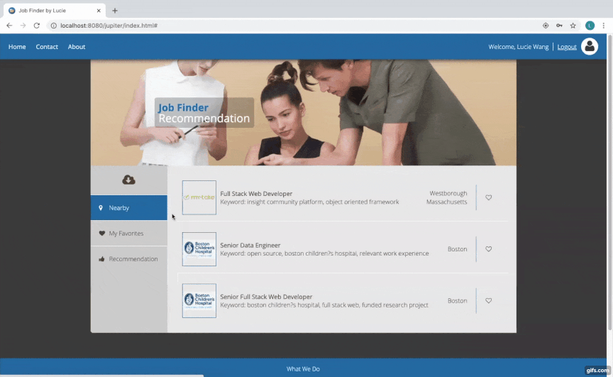

# job_finder

Job Finder is an interactive web application allowing users to search for available jobs nearby, favorite/unfavorite jobs and receive personalized recommendations based on user favorite history and location info. 

As an aspiring software engineer, it is not easy to take the first step in the job market, especially under the current circumstances. I would like to practice my skills in recommendation algorithsms and the fundamentals in Java, MySQL based back-end and HTML/CSS/JavaScript based front-end.
We have many amazing and convenient frameworks to use today but it is very important to be able to write "raw" code and understand the logic in the pure lanaguages.

Here are what I did for this project:
<ul>
<li>Built from scratch the front-end web development by implementing HTML, CSS, JavaScript, wire framing user flow, designing database, and test functionality to troubleshoot</li>
<li>Sustained fast and safe database management and communication by implementing RESTful APIs using Java servlets, retrieving job descriptions using GitHub API and storing data in MySQL</li>
<li>Realized personalized job recommendations by extracting keywords from job descriptions (Monkey Learn API), acquiring user geo location and implementing a content-based algorithm</li>
</ul>

<strong>Key features</strong>:
<ul>
  <li>Fully functional user registration, login, logout with encrpted password and front-end validations</li>
  <li>Ability to search jobs nearby using browser geo-location or IP address location info with GitHub Job API</li>
  <li>Cool feature of favorating/liking and unfavorating/unliking jobs</li>
  <li>Personalized job recommendations based on location info and job description keyword extraction supported by Monkey Learn API and self-written content based algorithm</li>
</ul>

